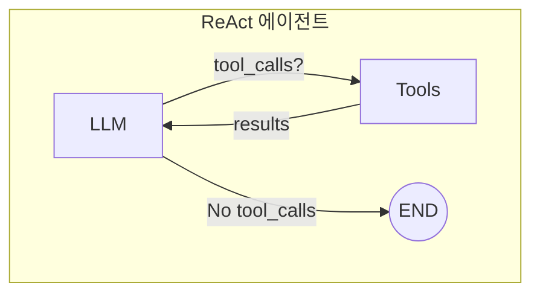

# 도구를 사용하는 에이전트

LangGraph로 **외부 도구를 호출할 수 있는 ReAct 에이전트**를 만들어봅니다. 이 패턴은 LLM이 필요에 따라 도구를 선택하고 호출하는 가장 일반적인 에이전트 구조입니다.

## ReAct 패턴 이해하기



## 완성 코드

```python
from typing import Annotated, Literal
from langchain_openai import ChatOpenAI
from langchain_core.messages import BaseMessage, HumanMessage, AIMessage, ToolMessage
from langchain_core.tools import tool
from langgraph.graph import StateGraph, MessagesState, START, END
from langgraph.checkpoint.memory import MemorySaver
from langgraph.prebuilt import ToolNode

# 1. 도구 정의
@tool
def get_weather(city: str) -> str:
    """지정된 도시의 현재 날씨를 조회합니다."""
    # 실제로는 날씨 API 호출
    weather_data = {
        "서울": "맑음, 15°C",
        "부산": "흐림, 18°C",
        "제주": "비, 20°C",
    }
    return weather_data.get(city, f"{city}의 날씨 정보를 찾을 수 없습니다.")

@tool
def calculate(expression: str) -> str:
    """수학 표현식을 계산합니다. 예: '2 + 3 * 4'"""
    try:
        result = eval(expression)
        return f"{expression} = {result}"
    except Exception as e:
        return f"계산 오류: {str(e)}"

@tool
def search_web(query: str) -> str:
    """웹에서 정보를 검색합니다."""
    # 실제로는 검색 API 호출
    return f"'{query}'에 대한 검색 결과: 관련 정보를 찾았습니다."

# 2. 도구 목록과 LLM 설정
tools = [get_weather, calculate, search_web]
llm = ChatOpenAI(model="gpt-4o-mini", temperature=0).bind_tools(tools)

# 3. 노드 함수 정의
def call_model(state: MessagesState) -> dict:
    """LLM을 호출하여 응답 생성"""
    response = llm.invoke(state["messages"])
    return {"messages": [response]}

# 4. 라우터 함수
def should_continue(state: MessagesState) -> Literal["tools", "__end__"]:
    """도구 호출이 필요한지 결정"""
    last_message = state["messages"][-1]

    if isinstance(last_message, AIMessage) and last_message.tool_calls:
        return "tools"
    return "__end__"

# 5. 그래프 구성
graph = StateGraph(MessagesState)

# 노드 추가
graph.add_node("agent", call_model)
graph.add_node("tools", ToolNode(tools))  # LangGraph 내장 ToolNode 사용

# 엣지 추가
graph.add_edge(START, "agent")
graph.add_conditional_edges(
    "agent",
    should_continue,
    {"tools": "tools", "__end__": END}
)
graph.add_edge("tools", "agent")  # 도구 실행 후 다시 에이전트로

# 6. 컴파일
memory = MemorySaver()
app = graph.compile(checkpointer=memory)

# 7. 실행 함수
def run_agent(query: str, thread_id: str = "default"):
    config = {"configurable": {"thread_id": thread_id}}
    result = app.invoke(
        {"messages": [HumanMessage(content=query)]},
        config
    )
    return result["messages"][-1].content

# 실행 예시
print(run_agent("서울 날씨 어때?"))
print(run_agent("15 * 24 + 100 계산해줘"))
```

## 단계별 설명

### 1단계: 도구 정의하기

`@tool` 데코레이터로 LLM이 호출할 수 있는 도구를 정의합니다:

```python
from langchain_core.tools import tool
from pydantic import BaseModel, Field

# 방법 1: 간단한 도구
@tool
def simple_tool(input: str) -> str:
    """도구 설명 (LLM이 이 설명을 보고 도구 선택)"""
    return f"결과: {input}"

# 방법 2: 복잡한 입력 스키마
class SearchInput(BaseModel):
    query: str = Field(description="검색할 쿼리")
    max_results: int = Field(default=5, description="최대 결과 수")

@tool(args_schema=SearchInput)
def advanced_search(query: str, max_results: int) -> str:
    """고급 검색을 수행합니다."""
    return f"'{query}'로 {max_results}개 결과 검색"
```

### 2단계: 커스텀 Tool 노드

ToolNode 대신 직접 구현할 수도 있습니다:

```python
def custom_tool_node(state: MessagesState) -> dict:
    """도구 호출을 직접 처리"""
    last_message = state["messages"][-1]
    tool_results = []

    # 도구 매핑
    tool_map = {
        "get_weather": get_weather,
        "calculate": calculate,
        "search_web": search_web,
    }

    for tool_call in last_message.tool_calls:
        tool_name = tool_call["name"]
        tool_args = tool_call["args"]

        # 도구 실행
        tool_fn = tool_map.get(tool_name)
        if tool_fn:
            result = tool_fn.invoke(tool_args)
        else:
            result = f"알 수 없는 도구: {tool_name}"

        # ToolMessage로 결과 반환
        tool_results.append(
            ToolMessage(
                content=str(result),
                tool_call_id=tool_call["id"]
            )
        )

    return {"messages": tool_results}
```

### 3단계: 반복 제한 추가

무한 루프를 방지하기 위해 반복 횟수를 제한합니다:

```python
class AgentState(MessagesState):
    iteration: int

def call_model_with_limit(state: AgentState) -> dict:
    response = llm.invoke(state["messages"])
    return {
        "messages": [response],
        "iteration": state["iteration"] + 1
    }

def should_continue_with_limit(state: AgentState) -> Literal["tools", "__end__"]:
    # 반복 제한 체크
    if state["iteration"] >= 10:
        return "__end__"

    last_message = state["messages"][-1]
    if isinstance(last_message, AIMessage) and last_message.tool_calls:
        return "tools"
    return "__end__"
```

## 전체 개선된 버전

```python
from typing import Annotated, Literal, TypedDict
from langchain_openai import ChatOpenAI
from langchain_core.messages import (
    BaseMessage, HumanMessage, AIMessage, ToolMessage, SystemMessage
)
from langchain_core.tools import tool
from langgraph.graph import StateGraph, MessagesState, START, END
from langgraph.checkpoint.memory import MemorySaver
from langgraph.prebuilt import ToolNode
import json
from datetime import datetime

# === 도구 정의 ===

@tool
def get_weather(city: str) -> str:
    """도시의 현재 날씨를 조회합니다."""
    weather_db = {
        "서울": {"temp": 15, "condition": "맑음", "humidity": 45},
        "부산": {"temp": 18, "condition": "흐림", "humidity": 60},
        "제주": {"temp": 20, "condition": "비", "humidity": 80},
        "대전": {"temp": 14, "condition": "맑음", "humidity": 50},
    }
    data = weather_db.get(city)
    if data:
        return f"{city}: {data['condition']}, {data['temp']}°C, 습도 {data['humidity']}%"
    return f"{city}의 날씨 정보를 찾을 수 없습니다."

@tool
def calculate(expression: str) -> str:
    """수학 표현식을 계산합니다. 예: '2 + 3 * 4', 'sqrt(16)', 'pow(2, 10)'"""
    import math
    try:
        # 안전한 평가를 위한 제한된 컨텍스트
        safe_dict = {
            "sqrt": math.sqrt,
            "pow": pow,
            "abs": abs,
            "round": round,
            "sin": math.sin,
            "cos": math.cos,
            "pi": math.pi,
        }
        result = eval(expression, {"__builtins__": {}}, safe_dict)
        return f"{expression} = {result}"
    except Exception as e:
        return f"계산 오류: {str(e)}"

@tool
def get_current_time() -> str:
    """현재 날짜와 시간을 반환합니다."""
    now = datetime.now()
    return now.strftime("%Y년 %m월 %d일 %H시 %M분")

@tool
def unit_convert(value: float, from_unit: str, to_unit: str) -> str:
    """단위를 변환합니다. 지원: km/m, kg/g, celsius/fahrenheit"""
    conversions = {
        ("km", "m"): lambda x: x * 1000,
        ("m", "km"): lambda x: x / 1000,
        ("kg", "g"): lambda x: x * 1000,
        ("g", "kg"): lambda x: x / 1000,
        ("celsius", "fahrenheit"): lambda x: x * 9/5 + 32,
        ("fahrenheit", "celsius"): lambda x: (x - 32) * 5/9,
    }
    key = (from_unit.lower(), to_unit.lower())
    if key in conversions:
        result = conversions[key](value)
        return f"{value} {from_unit} = {result:.2f} {to_unit}"
    return f"지원하지 않는 변환: {from_unit} -> {to_unit}"

# === 에이전트 구성 ===

tools = [get_weather, calculate, get_current_time, unit_convert]
tool_node = ToolNode(tools)

# 시스템 프롬프트
SYSTEM_PROMPT = """당신은 다양한 도구를 활용할 수 있는 AI 어시스턴트입니다.

사용 가능한 도구:
- get_weather: 도시의 날씨 조회
- calculate: 수학 계산
- get_current_time: 현재 시간 조회
- unit_convert: 단위 변환

규칙:
1. 필요한 경우에만 도구를 사용하세요
2. 도구 결과를 자연스럽게 설명해주세요
3. 한국어로 응답하세요
4. 도구로 해결할 수 없는 질문은 직접 답변하세요"""

llm = ChatOpenAI(model="gpt-4o-mini", temperature=0).bind_tools(tools)

# State 정의
class AgentState(MessagesState):
    iteration: int

def call_agent(state: AgentState) -> dict:
    """에이전트(LLM) 호출"""
    # 첫 호출시 시스템 프롬프트 추가
    messages = state["messages"]
    if not any(isinstance(m, SystemMessage) for m in messages):
        messages = [SystemMessage(content=SYSTEM_PROMPT)] + messages

    response = llm.invoke(messages)
    return {
        "messages": [response],
        "iteration": state["iteration"] + 1
    }

def should_continue(state: AgentState) -> Literal["tools", "end"]:
    """다음 단계 결정"""
    # 반복 제한
    if state["iteration"] >= 10:
        return "end"

    last_message = state["messages"][-1]
    if isinstance(last_message, AIMessage) and last_message.tool_calls:
        return "tools"
    return "end"

# 그래프 구성
graph = StateGraph(AgentState)

graph.add_node("agent", call_agent)
graph.add_node("tools", tool_node)

graph.add_edge(START, "agent")
graph.add_conditional_edges(
    "agent",
    should_continue,
    {"tools": "tools", "end": END}
)
graph.add_edge("tools", "agent")

# 컴파일
memory = MemorySaver()
app = graph.compile(checkpointer=memory)

# === 실행 인터페이스 ===

def run_agent(query: str, thread_id: str = "default", verbose: bool = False):
    """에이전트 실행"""
    config = {"configurable": {"thread_id": thread_id}}

    if verbose:
        print(f"\n질문: {query}")
        print("-" * 40)

        # 스트리밍으로 과정 출력
        for event in app.stream(
            {"messages": [HumanMessage(content=query)], "iteration": 0},
            config,
            stream_mode="updates"
        ):
            for node, update in event.items():
                if node == "agent":
                    msg = update["messages"][0]
                    if msg.tool_calls:
                        for tc in msg.tool_calls:
                            print(f"[도구 호출] {tc['name']}: {tc['args']}")
                elif node == "tools":
                    for msg in update["messages"]:
                        print(f"[도구 결과] {msg.content[:100]}...")

        print("-" * 40)
        state = app.get_state(config)
        return state.values["messages"][-1].content
    else:
        result = app.invoke(
            {"messages": [HumanMessage(content=query)], "iteration": 0},
            config
        )
        return result["messages"][-1].content

# === 테스트 ===

if __name__ == "__main__":
    print("=== 다기능 AI 에이전트 ===\n")

    # 테스트 쿼리들
    queries = [
        "서울과 부산 날씨를 비교해줘",
        "123 * 456 + 789 계산해줘",
        "지금 몇 시야?",
        "100km를 m로 변환해줘",
        "섭씨 30도를 화씨로 바꾸면?",
    ]

    for query in queries:
        print(f"Q: {query}")
        answer = run_agent(query, verbose=True)
        print(f"A: {answer}\n")
        print("=" * 50 + "\n")
```

## 실행 결과 예시

```
=== 다기능 AI 에이전트 ===

Q: 서울과 부산 날씨를 비교해줘
----------------------------------------
[도구 호출] get_weather: {'city': '서울'}
[도구 호출] get_weather: {'city': '부산'}
[도구 결과] 서울: 맑음, 15°C, 습도 45%...
[도구 결과] 부산: 흐림, 18°C, 습도 60%...
----------------------------------------
A: 서울과 부산의 날씨를 비교해 드릴게요:

**서울**: 맑음, 15°C, 습도 45%
**부산**: 흐림, 18°C, 습도 60%

부산이 서울보다 3도 정도 따뜻하지만, 구름이 있어요.
서울은 맑고 건조한 편이에요.

==================================================

Q: 123 * 456 + 789 계산해줘
----------------------------------------
[도구 호출] calculate: {'expression': '123 * 456 + 789'}
[도구 결과] 123 * 456 + 789 = 56877...
----------------------------------------
A: 계산 결과는 **56,877**입니다.

(123 × 456 = 56,088, 56,088 + 789 = 56,877)
```

## 다음 단계

- [Human-in-the-Loop](/docs/advanced/human-in-the-loop) - 도구 호출 전 사람 승인
- [스트리밍](/docs/advanced/streaming) - 실시간 도구 실행 모니터링
- [체크포인팅](/docs/advanced/checkpointing) - 에이전트 상태 저장
